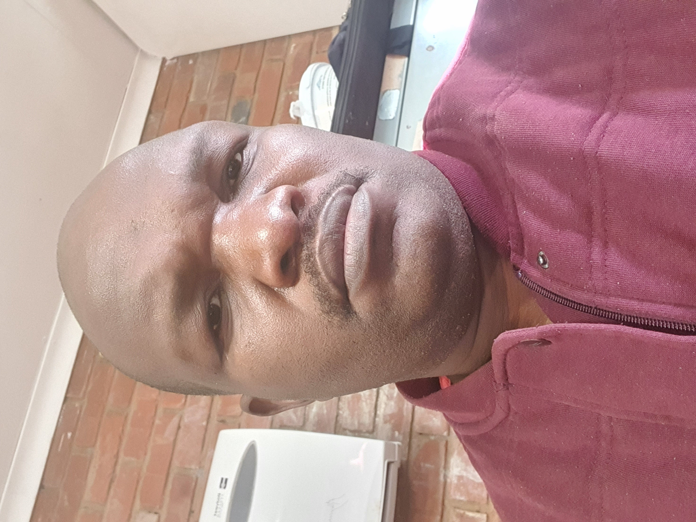

# Welcome to Lucky's Page

Hi! I'm **Lucky Marange**, a passionate software developer with a BSc in IT from **North-West University (NWU)**. I enjoy solving real-world problems using technology and building efficient, scalable applications.

---

### 👨‍💻 About Me
- 🎓 BSc in Information Technology — NWU
- 💼 Aspiring full-stack developer
- 🔐 Interest in Cybersecurity & DevOps
- 🌍 Based in South Africa

---

### 🛠 Skills & Technologies
- **Languages:** Java, Python, JavaScript, HTML, CSS
- **Databases:** Oracle SQL, MySQL
- **Tools:** Git, GitHub, VS Code, Linux, Docker
- **Frameworks:** Bootstrap, React (beginner), Spring Boot (learning)

---

### 📫 Contact Me
Feel free to reach out by email: [marangelucky@gmail.com](mailto:marangelucky@gmail.com)

---

Thanks for visiting!

